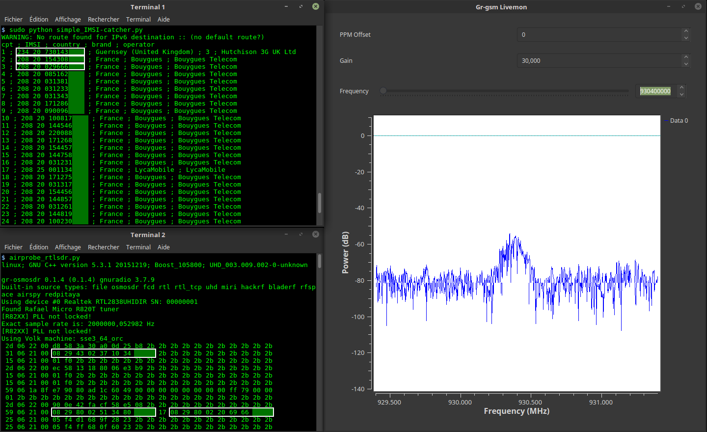

# IMSI-catcher
This program shows you IMSI numbers, country, brand and operator of cellphones around you.  
  
/!\ This program was made to understand how GSM network work. Not for bad hacking !  
  

  
  

What you need
=============
1 PC  
1 [USB DVB-T key (RTL2832U)](https://osmocom.org/projects/sdr/wiki/rtl-sdr) with antenna (less than 15$) or a [OsmocomBB phone](https://osmocom.org/projects/baseband/wiki/Phones)   or [HackRF](https://greatscottgadgets.com/hackrf/)  
  
  
Setup
=====

```
sudo apt install python-numpy python-scipy python-scapy

sudo add-apt-repository -y ppa:ptrkrysik/gr-gsm
sudo apt update
sudo apt install gr-gsm
```
If gr-gsm failled to setup. Try this setup : https://github.com/ptrkrysik/gr-gsm/wiki/Installation


Run
===
  
Open 2 terminals.  
In terminal 1 (if you have the last version of gr-gsm)  
```
python simple_IMSI-catcher.py
```  
Or
```
sudo python simple_IMSI-catcher.py --sniff
```  
You can add -h to display options.  

In terminal 2  
```
grgsm_livemon
```
Now, change the frequency and stop it when you have output like :  
```
15 06 21 00 01 f0 2b 2b 2b 2b 2b 2b 2b 2b 2b 2b 2b 2b 2b 2b 2b 2b 2b
25 06 21 00 05 f4 f8 68 03 26 23 2b 2b 2b 2b 2b 2b 2b 2b 2b 2b 2b 2b
49 06 1b 95 cc 02 f8 02 01 9c c8 03 1e 57 a5 01 79 00 00 1c 13 2b 2b
...
```
Now, watch terminal 1 and wait. IMSI numbers should appear :-)  
If nothing appears after 1 min, change the frequency.  
  
Doc : https://fr.wikipedia.org/wiki/Global_System_for_Mobile_Communications  
Example of frequency in France : 9.288e+08 Bouygues  
  
You can watch GSM packets with  
```
sudo wireshark -k -Y '!icmp && gsmtap' -i lo
```
  
Optional
========
  
Information about the cell tower :  
```
sudo python find_cell_id.py
```
  
Get immediate assignment :  
```
sudo python immediate_assignment_catcher.py
```

Find frequencies (HackRF only)
------------------------------

Setup  
```
sudo apt-get install automake autoconf libhackrf-dev
git clone https://github.com/scateu/kalibrate-hackrf
cd kalibrate-hackrf/
./bootstrap
./configure
make
sudo make install
```
Run  
```
kal -s GSM900
```
```
kal: Scanning for GSM-900 base stations.
GSM-900:
	chan:   14 (937.8MHz + 10.449kHz)	power: 3327428.82
	chan:   15 (938.0MHz + 4.662kHz)	power: 3190712.41
...
```
  
Links
=====

Setup of Gr-Gsm : https://github.com/ptrkrysik/gr-gsm/wiki/Installation  
Frequency : http://www.worldtimezone.com/gsm.html and https://fr.wikipedia.org/wiki/Global_System_for_Mobile_Communications  
Mobile Network Code : https://en.wikipedia.org/wiki/Mobile_Network_Code  
Scapy : http://secdev.org/projects/scapy/doc/usage.html  
IMSI : https://fr.wikipedia.org/wiki/IMSI  
Realtek RTL2832U : https://osmocom.org/projects/sdr/wiki/rtl-sdr and http://doc.ubuntu-fr.org/rtl2832u and http://doc.ubuntu-fr.org/rtl-sdr  
